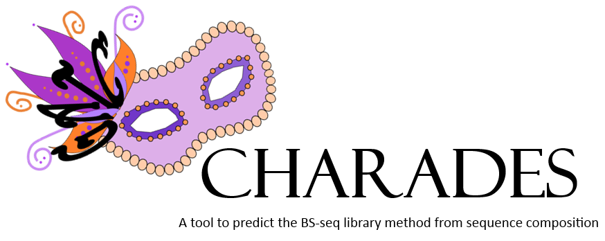

## Overview

Different methods to generate bisulfite sequencing libraries result in sequencing data that require different downstream processing. For example, there are stranded and non-stranded libraries, reads may start with a different number of random bases that need to be removed or reads may only start at a restriction site. It is therefore necessary to know the library type before starting processing.

Charades is a tool that predicts the library type from sequencing data itself. Different types of bisulfite libraries differ in their base composition along the read. Charades first extracts base composition for a set of indicator positions along the read and then uses a logistic regression classifier to predict the method the library was generated with. Probabilities for each library are reported.

## A bit more detail

### Determining which files to analyse
The input for Charades are gzipped Fastq files (fastq.gz). If paired end or indexed reads are present, it will disregard any file containing "R2", "R3" or "R4". By default the current directory will be searched but a path can be provided.

### Extracting the base composition info
Charades will then extract the first 100 000 reads from each file and collect base composition information for 11 positions between base 1 and 30. The base composition information is written to a file called 'sequence_composition_stats.csv' and 'sequence_composition_stats.arff' the latter being the input format for the machine learning software Weka.

### Predicting the libray
Charades the calls WEKA to use a logistic regression classifier to predict the library type from the base compositin information. For this a file with training data is provided: 'training_data_20181211.arff'. This currently contains base composition information for 236 bisulfite libraries from 12 different library types. Prediction accuracy is at 99 % using 10-fold cross-validation.

### Reporting the prediction
Charades will report the predicted library directly in the console, but it will also save the Weka output and a tab delimited file containing the probabilities for each library (class.probabilities.txt). If R is available, a graphical summary heatmap is also produced.

## What you need
- Perl
- Weka
- R (with the tidyverse package if you want a graphical output)
- write permission to the working directory
- the training data file in the same directory as charades itself
- files to analyse in fastq.gz format

## Disclaimer
This is a first working version of Charades which I'm sure has many teething problems. Please report any issues on github or to christel.krueger@babraham.ac.uk.

### A few known issues
- Charades currently always puts out a prediction. Even if the sample is not a bisulfite library at all.
- sc_6N and sc_NOMe-seq libraries look ridiculously similar in their base composition. Charades sometimes mixes them up.
- If Charades crashes it leaves behind a temp folder which needs to be deleted before it can run again.
